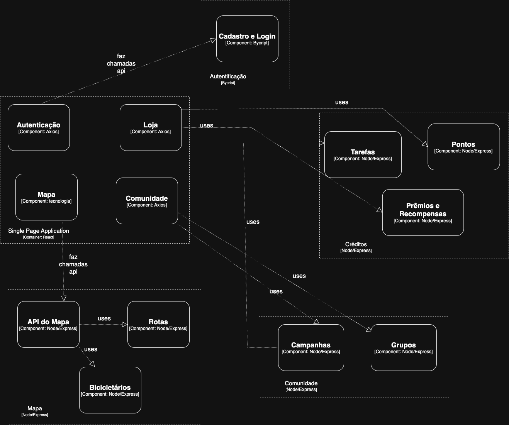

# Projeto de Mobilidade Ativa Unicamp - MC426

O projeto propõe o desenvolvimento de um aplicativo para incentivar a mobilidade ativa dentro do campus da Unicamp. O sistema funcionará por meio da acumulação de créditos conforme o usuário utilizar meios sustentáveis de transporte, como bicicletas ou caminhadas. Além disso, o aplicativo irá mapear bicicletários, indicando a quantidade de bicicletas e vagas disponíveis.

O objetivo é melhorar a mobilidade no campus, facilitar o uso de bicicletas e estimular deslocamentos sustentáveis com um sistema de incentivo.

## Integrantes
- Caio Vinicius Castro dos Santos - 214188
- Fernando de Araujo Sacerdote - 240807
- Rodrigo de Araujo Sacerdote - 224176
- Tiago Perrupato Antunes - 194058

---

## Ciclo de Desenvolvimento

Adotamos um ciclo de desenvolvimento iterativo, abrangendo desde a concepção de requisitos até a entrega, com as seguintes etapas:

### 1. Processos
Nossa metodologia de processo foi iniciada com uma sessão de **brainstorming** para levantar ideias, contrapontos e soluções para os problemas relacionados à mobilidade no campus. As conclusões dessa sessão guiaram a criação dos épicos do projeto. Utilizamos o **GitHub** como plataforma central para gerenciamento de código e controle de versão, e o **GitHub Actions** para automação da integração contínua.

### 2. Gerência de Configuração
A gerência de configuração do projeto é realizada com as seguintes ferramentas e práticas:
* **Controle de Versão:** Utilizamos o **Git** para controle de versão, com o código-fonte hospedado em um monorepositório no **GitHub**.
* **Estratégia de Branches:** Adotamos um fluxo com as branches `develop` e `main`, onde a branch `develop` é utilizada para integração de novas funcionalidades e a `main` para versões estáveis.
* **Integração Contínua (CI):** Temos um workflow de CI configurado com **GitHub Actions** (`.github/workflows/node.js.yml`) que é acionado em cada `push` ou `pull request` para as branches `main` e `develop`. O pipeline instala as dependências do backend e executa os testes automatizados para garantir a integridade do código.
* **Gerenciamento de Dependências:**
    * **Backend:** As dependências são gerenciadas pelo **NPM** através do arquivo `backend/package.json`. O `backend/package-lock.json` garante a consistência das versões das dependências.
    * **Frontend:** Similarmente, o `frontend/package.json` e o `frontend/package-lock.json` gerenciam as dependências do frontend.

### 3. Requisitos
Os requisitos foram levantados a partir de uma sessão de brainstorming documentada em `REQUIREMENTS.md`. Os principais épicos identificados para o projeto foram:
* **Mapa Interativo:** Necessidade de um mapa para visualização de rotas e bicicletários.
* **Sistema de Gamificação:** Implementação de um sistema de prêmios e recompensas para incentivar o uso.
* **Comunidades e Campanhas:** Funcionalidades para interação social e engajamento coletivo através de desafios.

### 4. Arquitetura do Sistema

#### 1. Diagrama de Componentes (C4 - Nível 3)



#### 2. Estilo Arquitetural

- **Microserviços**: 
  - Serviços independentes com banco de dados dedicados
  - Frontend desacoplado
  
- **Frontend Desacoplado**:
  - Single Page Application
  - Consumo de APIs via API Gateway

#### 3. Descrição dos Componentes e Responsabilidades

##### **Frontend (SPA)**
- **Autenticação**: Gerencia interfaces de login/registro, integrando com backend.
- **Mapa**: Exibe rotas otimizadas e status de bicicletários em tempo real.   
- **Comunidade**: Permite visualização e interação com grupos/campanhas. 
- **Loja**: Facilita o resgate de prêmios usando créditos acumulados.  

##### **Auth Service**
- **Cadastro e Login**: Valida credenciais e emite tokens de autenticação seguros.  

##### **Comunidade Service**
- **Campanhas**: Cria e gerencia desafios coletivos com regras personalizáveis.   
- **Grupos**: Organiza usuários em comunidades com interação em tempo real.    

##### **Mapa Service**
- **API do Mapa**: Integra com serviços externos para renderização de mapas.   
- **Rotas**: Calcula trajetos eficientes para mobilidade ativa.   
- **Bicicletários**: Monitora vagas e atualiza status.   

##### **Crédito Service**
- **Prêmios e Recompensas**: Gerencia sistema de recompensas usando Abstract Factory.  
- **Pontos**: Registra acúmulo e histórico de pontos dos usuários.  
- **Tarefas**: Define atividades para ganho de pontos (ex: rotas concluídas).   

### 5. Padrão de Projeto: Abstract Factory

Para o componente Prêmios e Recompensas escolhemos o padrão de projeto de Abstract Factory (Fábrica Abstrata), pois teremos uma classe base chamada Rewards que conterá as propriedades comuns de todas as recompensas como quantidade de pontos, data de início e fim de disponibilidade, mas ela não vai ser instanciável pois ainda falta o jeito que será entregue, para isso teremos classes herdando Rewards com sua implementação específica para a entrega e qualquer processamento a mais necessário.
### 6. Testes
A qualidade do backend é garantida por meio de uma suíte de testes automatizados.
* **Ferramentas:** Utilizamos **Jest** como framework de testes e **Supertest** para realizar testes de integração nas rotas da API.
* **Cobertura:** Os testes cobrem as principais funcionalidades da API, como:
    * Autenticação (`signin.test.js`, `signup.test.js`)
    * Criação de Recompensas (`rewards.test.js`)
    * Cálculo de Rotas (`bikeRoute.test.js`)
    * Consulta de Bicicletários (`bikeRacks.test.js`)
* **Estratégias de Teste:** Empregamos técnicas de teste de caixa-preta, como **Particionamento por Equivalência** e **Análise de Valor Limite**, para validar as regras de negócio nas rotas, como pode ser visto nos arquivos `signin.test.js` e `rewards.test.js`.

### 7. Liberação
O processo de liberação é automatizado pelo workflow de CI/CD no GitHub Actions. Novas versões são integradas na branch `develop` e, após validadas, são mescladas na `main`, que representa a versão em produção. O pipeline garante que apenas código testado e funcional seja liberado.

---

## Estrutura do Projeto e Tecnologias

### Linguagens e Ferramentas

* **Backend:**
    * **Linguagem:** Node.js com ES Modules.
    * **Framework:** Express.js para a criação da API REST.
    * **Bibliotecas Principais:** `axios` para chamadas a serviços externos, `bcrypt` para hashing de senhas, `joi` para validação de schemas, `dotenv` para variáveis de ambiente.
* **Frontend:**
    * **Linguagem:** JavaScript com JSX.
    * **Framework:** React.
    * **Bibliotecas Principais:** `react-leaflet` para a implementação dos mapas, `react-router-dom` para navegação.
    * **Build Tool:** Vite.

### Arquivos de Configuração

* `backend/package.json`: Define os scripts e dependências do backend.
* `frontend/package.json`: Define os scripts e dependências do frontend.
* `.github/workflows/node.js.yml`: Configuração do workflow de Integração Contínua para o backend.
* `frontend/vite.config.js`: Arquivo de configuração do Vite.
* `frontend/eslint.config.js`: Regras do linter para o código do frontend.
* `.gitignore`: Lista os arquivos e diretórios ignorados pelo Git em ambos os ambientes.

---

## Instalação e Execução

Siga os passos abaixo para instalar e rodar a aplicação em seu ambiente local.

### Pré-requisitos

* Node.js (versão 22.x ou superior)
* NPM (geralmente instalado com o Node.js)

### Configuração da API de Rotas

A funcionalidade de cálculo de rotas depende do **OpenRouteService (ORS)**, que exige uma chave de API.

1.  Acesse o site [OpenRouteService](https://openrouteservice.org/) e crie uma conta gratuita.
2.  No painel de desenvolvedor, solicite uma chave de API (API Key).
3.  Copie a chave gerada.

### Backend

1.  **Navegue até a pasta do backend:**
    ```bash
    cd backend
    ```

2.  **Crie o arquivo de variáveis de ambiente:** Crie um arquivo chamado `.env` na raiz da pasta `backend`.

3.  **Adicione a chave do ORS ao arquivo `.env`:** Cole a chave obtida no passo anterior no arquivo `.env`, como no exemplo abaixo:
    ```
    ORS_API_KEY=SUA_CHAVE_DE_API_AQUI
    ```

4.  **Instale as dependências:**
    ```bash
    npm install
    ```

5.  **Inicie o servidor de desenvolvimento:**
    ```bash
    npm run dev
    ```
    O servidor do backend estará rodando em `http://localhost:3000`.

### Frontend

1.  **Abra um novo terminal e navegue até a pasta do frontend:**
    ```bash
    cd frontend
    ```

2.  **Instale as dependências:**
    ```bash
    npm install
    ```

3.  **Inicie o servidor de desenvolvimento:**
    ```bash
    npm run dev
    ```
    A aplicação frontend estará acessível em `http://localhost:5173` (ou outra porta indicada pelo Vite).

